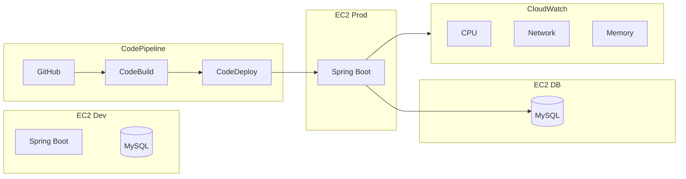

# 📘 프로젝트 소개

## 🚀 개요

Spring Boot와 MySQL을 기반으로 한 웹 애플리케이션입니다.  
운영 환경과 개발 환경을 분리하고, AWS CodePipeline을 활용해 자동 배포(CI/CD)를 구축했습니다.  
CloudWatch를 통한 서버 모니터링과 Swagger 기반의 API 문서화를 지원합니다.

---

## 🛠 기술 스택

- **Backend**: Java 21, Spring Boot
- **Database**: MySQL 8
- **Infra**: AWS EC2
- **CI/CD**: AWS CodePipeline, CodeBuild, CodeDeploy
- **Monitoring**: AWS CloudWatch
- **Docs**: Swagger

---

## ⚙️ 인프라 구조

- **EC2 Prod**: Spring Boot 애플리케이션 서버
- **EC2 DB**: MySQL 전용 서버
- **EC2 Dev**: 개발 및 테스트 서버 (Spring + MySQL)

보안 관리를 위해 애플리케이션 설정은 OS 환경 변수로 관리합니다.

---

## 🔄 CI/CD

- GitHub 소스 코드 → CodeBuild (빌드/테스트) → CodeDeploy (배포)
- 운영 서버에 단일 인스턴스로 배포

---

## 📊 모니터링

- 기본 메트릭: CPU, 네트워크
- 커스텀 메트릭: 메모리 (CloudWatch Agent)

---

## 📄 API 문서

- Swagger UI 제공 (`/swagger-ui/index.html`)
- 모든 엔드포인트와 인증 API 문서화

---

## 🗺 아키텍처 다이어그램

